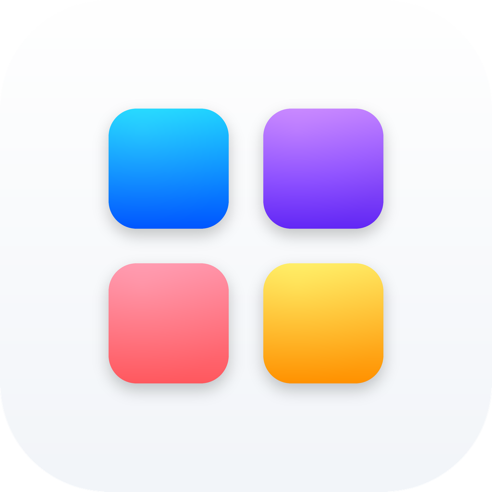
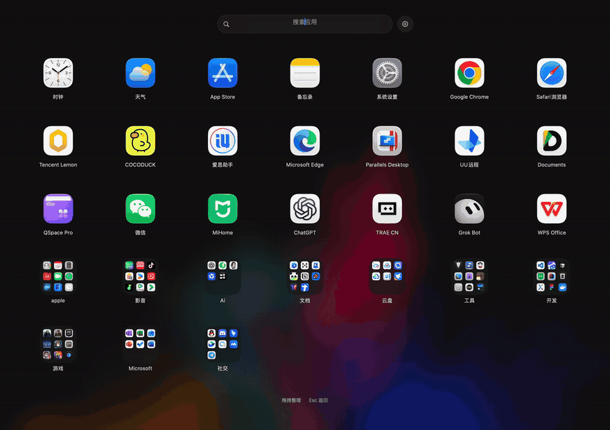

<p align="right"><a href="README.md">English</a> · <strong>简体中文</strong></p>

<p align="center">
  
</p>

<h1 align="center">LaunchIcon</h1>

<p align="center"><strong>为 macOS 26+ 做的轻量、本地优先的应用网格启动器。</strong><br>
按 <kbd>⌥ Space</kbd> 呼出 7 × 5 应用网格，用文件夹分类、拖拽整理，支持汉字、拼音全拼和首字母搜索。<br>
原生 AppKit · 无需账号 · 不联网 · 布局只存在你的 Mac 上。</p>

<p align="center">
  <a href="https://github.com/sunzhengnj/LaunchIcon-OSS/releases/latest"></a>
  <a href="https://github.com/sunzhengnj/LaunchIcon-OSS/actions/workflows/macos-validation.yml"></a>
  <a href="LICENSE"></a>
  
  
</p>

<p align="center">
  <a href="https://github.com/sunzhengnj/LaunchIcon-OSS/releases/latest"><strong>⬇ 下载（未公证预览版）</strong></a> ·
  <a href="#安装">安装</a> ·
  <a href="#已知限制">已知限制</a> ·
  <a href="#从源码构建">从源码构建</a> ·
  <a href="CONTRIBUTING.md">参与贡献</a>
</p>

<!-- 演示位：提交 Docs/Media/demo.gif 后取消注释。
<p align="center"></p>
-->

> [!NOTE]
> **早期版本，欢迎反馈**。安装包采用 ad-hoc 签名，**尚未完成 Apple 公证**（见[安装](#安装)）。完整 UI 测试还没有全部通过，跨页拖拽仍在修复中。详见[已知限制](#已知限制)。

> [!IMPORTANT]
> **源码与安装包不是同一版本。** `main` 现包含更新的 **WIP 开发源码快照**。[v1.0.0 安装包](https://github.com/sunzhengnj/LaunchIcon-OSS/releases/tag/v1.0.0) 由较早的源码构建，不包含下述新改动。目前没有对应 `main` 的新安装包。详见[源码快照说明](Docs/SOURCE_SNAPSHOT_2026-10-09.md)。

## 亮点

- **7 × 5 应用网格，支持分页**。用鼠标或键盘都能浏览。
- **文件夹与拖拽整理**。自由排序，创建和重命名文件夹，把用不到的 App 隐藏起来。
- **搜索快，中文友好**。可搜应用名称和别名；中文名称支持拼音全拼或首字母（例如 `wx` → 微信）。
- **`⌥ Space` 一键呼出**，也可以从菜单栏打开；快捷键可在设置中更换。
- **本地优先，保护隐私**。无需账号，没有云同步，不发起网络请求；布局与偏好只保存在本机。
- **原生、轻量**。基于 Swift 和 AppKit，用 macOS 公开 API 查找已安装应用，遵循“减少动态效果”设置。

## 功能

| 浏览 | 整理 | 查找 |
| --- | --- | --- |
| 7 × 5 应用网格、分页和键盘导航 | 拖拽排序、创建和重命名文件夹 | 搜索应用名称与别名 |
| 使用 macOS 公开 API 扫描已安装应用 | 布局与偏好只保存在本机 | 用拼音全拼或首字母搜索中文名称 |
| 通过 `⌥ Space` 或菜单栏打开 | 隐藏应用，并在设置中恢复 | 当前源码提供中文和英文界面 |

LaunchIcon 使用自己的视觉设计，不读取系统 Launchpad 数据库、不复制其他启动器的资源，也不需要账号或云同步。应用遵循 macOS 的“减少动态效果”设置。拼音转写使用 Foundation 的默认读音。

### 当前源码快照新增

- 应用启动请求等待 10 秒后会撤去持续加载状态并给出超时提示。打开 LaunchIcon 时默认显示主界面。
- 把图标拖到屏幕左右边缘可悬停翻页。文件夹取消 25 个应用的上限，封面最多预览九个图标。
- 文件夹合并动画从松手位置开始。Direct 应用加入中英文界面文案。

这些改动仍需完整 UI 和实体输入验收。**Dock / 访达随深色模式切换的 App 图标尚未实现**；已有的深色品牌图片不是 AppIcon 外观变体。

## 安装

1. 从 [v1.0.0 Release](https://github.com/sunzhengnj/LaunchIcon-OSS/releases/tag/v1.0.0) 下载 `LaunchIcon-v1.0.0-macOS-unnotarized.dmg` 和同页的 `.sha256` 文件，在两个文件所在的文件夹里核对完整性：
   ```bash
   shasum -a 256 -c LaunchIcon-v1.0.0-macOS-unnotarized.dmg.sha256
   ```
2. 打开 DMG，把 `LaunchIcon.app` 拖进“应用程序”。替换旧版前先退出旧 App；布局与偏好保存在 App 包之外，不会丢失。
3. 先打开一次 LaunchIcon。macOS 会提示无法验证开发者，这是正常现象：App 采用 **ad-hoc 签名，尚未完成公证**。
4. 仅在确认下载来自本仓库且信任它时，打开 **系统设置 → 隐私与安全性**，滚动到“安全性”，点击 LaunchIcon 旁边的 **仍要打开**，再用密码或触控 ID 确认。从 macOS 15 起，**右键（Control-点按）→ 打开已无法绕过这个提示**。参见 [Apple 安全说明](https://support.apple.com/102445)。
5. **v1.0.0 安装包启动后在后台就绪，不会弹出窗口**。按 `⌥ Space` 或点击菜单栏图标呼出网格。（新版源码快照打开时会直接显示主界面。）

请不要关闭 Gatekeeper，也不要运行来源不明的解除隔离命令。如果不想运行未公证的安装包，可以用 Xcode [从源码构建](#从源码构建)。

## 已知限制

- 安装包是 ad-hoc 签名，没有 Developer ID 签名，也没有经过 Apple 公证。
- 最近一次完整 UI 测试为 **47 通过 / 5 失败 / 2 跳过**，尚未在当前快照上重跑。
- 跨页拖拽仍在修复中；实体输入、VoiceOver、大文件夹和 Dock / 访达深色图标的验证尚未完成。
- v1.0.0 安装包启动后在后台运行（用 `⌥ Space` 或菜单栏图标呼出）。
- 需要 macOS 26 或更高版本。

## 从源码构建

**环境要求：** macOS 26 或更新版本、Xcode 27 及对应 SDK。

```bash
git clone https://github.com/sunzhengnj/LaunchIcon-OSS.git
cd LaunchIcon-OSS
./script/validate_background.sh
```

在 Xcode 中打开 `LaunchIcon.xcodeproj`，为签名配置你自己的 Apple 开发团队。仓库不包含维护者的 Team ID、证书或公证凭据。

后台质量门会运行网络 API 静态守卫、Core 测试、Direct 与 StoreSpike 的 Release 分析，以及 UI 测试目标编译。**它不会启动 App 或运行完整 UI 测试。**可见测试会占用桌面，只能在电脑使用者同意的时段运行：

```bash
LAUNCHICON_ALLOW_VISIBLE_TESTS=1 ./script/test_direct_bootstrap.sh
```

`StoreSpike` 仅用于验证沙箱可行性，不是 App Store 正式版。预览包与正式签名的脚本入口分别在 `script/package_preview.sh` 和 `script/distribution_preflight.sh`。

## 项目状态

| 范围 | 当前证据 |
| --- | --- |
| Core 与构建 | 当前公开源码在本机 Core **129/129**、Direct/StoreSpike Release 分析、UI 目标编译和 [GitHub macOS 后台验证](https://github.com/sunzhengnj/LaunchIcon-OSS/actions/workflows/macos-validation.yml) 通过；Direct Release 构建也在本机通过。 |
| 完整 UI | 本次快照前最近一次完整 UI 记录为 **47 通过 / 5 失败 / 2 跳过**；公开源码快照尚未重跑全套。 |
| 发布 | 当前 `main` 尚无对应安装包。v1.0.0 DMG 仍是 ad-hoc 签名、未公证。 |
| 待验 | 实体拖拽、大文件夹、逐个目标应用启动、VoiceOver、Store 沙箱和 Dock/访达深色图标。 |

CI 徽章**只代表后台质量门**，不表示完整 UI 或发布验收通过。详见[测试矩阵](Docs/TEST_MATRIX.md)与[源码快照说明](Docs/SOURCE_SNAPSHOT_2026-10-09.md)。

## 参与贡献

欢迎提交 Issue 和 Pull Request。改代码前请阅读 [CONTRIBUTING.md](CONTRIBUTING.md) 与 [AGENTS.md](AGENTS.md)。改动应对应已记录的需求或可复现 bug；汇报时分开写明 Core、UI 与安装包的验证结果。反馈问题请附应用版本、macOS 版本、芯片和复现步骤，并从日志、崩溃报告、布局与偏好文件中移除个人信息。

日常开发在维护者的另一个仓库进行；本公开仓接收经审查的发布版本和明确标记的源码快照。见[同步规则](Docs/SYNC_FROM_PRIVATE.md)。

## 许可证

代码与文档采用 [Apache License 2.0](LICENSE)，参见 [NOTICE](NOTICE)。LaunchIcon 名称和品牌图样用于标识本项目，许可证不自动授予商标使用权。LaunchIcon 不是 Apple Launchpad 的克隆。
